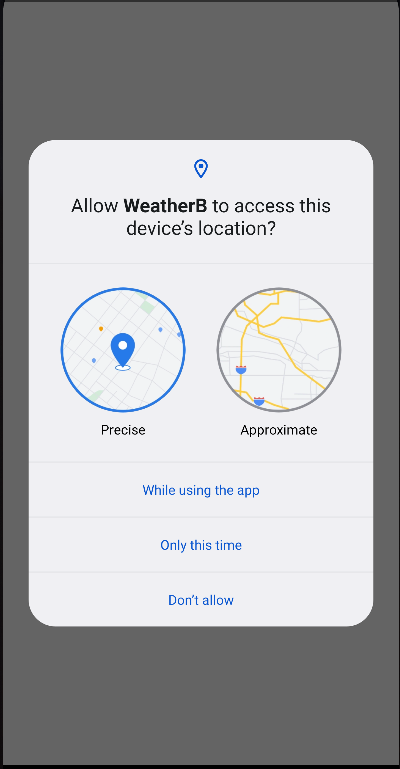
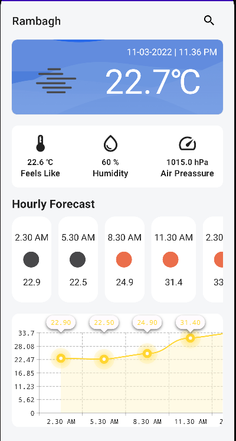
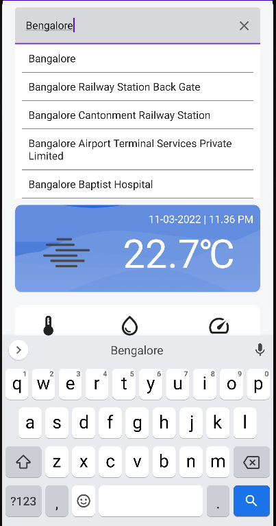

SkyPeeker is an android app made with Jetpack compose and kotlin that show weather status for your location

## Made with the use of Modern Android development tools:

- [Kotlin](https://developer.android.com/kotlin)

- [Jetpack Compose](https://developer.android.com/jetpack/compose)

- [Retrofit](https://square.github.io/retrofit/)

- [MVVM](https://developer.android.com/jetpack/guide)

- [Dagger-Hilt](https://developer.android.com/training/dependency-injection/hilt-android) 

- [Coroutines](https://developer.android.com/kotlin/coroutines)

- [Flows](https://developer.android.com/kotlin/flow)

- [Preferences DataStore](https://developer.android.com/topic/libraries/architecture/datastore)

### APIs Used
* [OpenWeather](https://openweathermap.org/)
* [Google Places](https://developers.google.com/maps/documentation/places/web-service/overview)

## Features:

- Shows current weather status for user's location

- Hourly forecast

- 24 Hrs weather graph

- Search Location for its weather details

## Screenshots:

<table>
  <tr>
     <td>Access user's location</td>
     <td>Home Screen</td>
     <td>Search for location</td>
  </tr>
  <tr>
    <td></td>
    <td></td> 
    <td></td>
  </tr>
 </table>